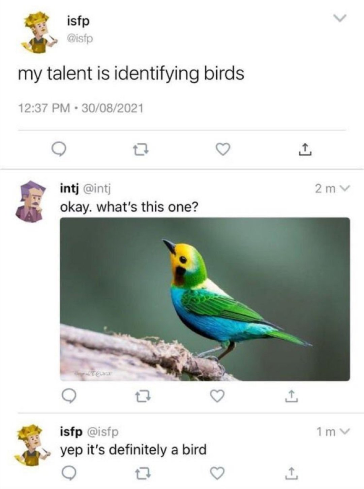
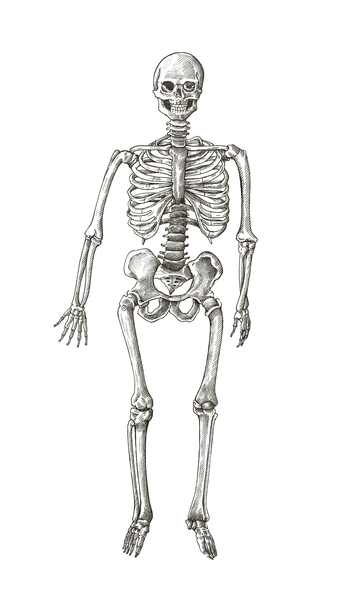
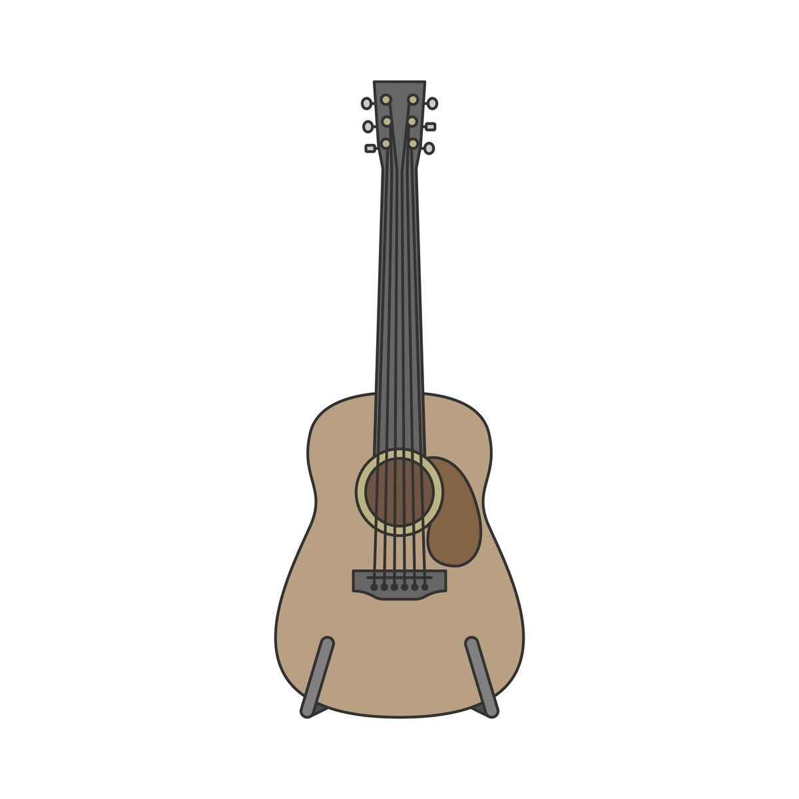
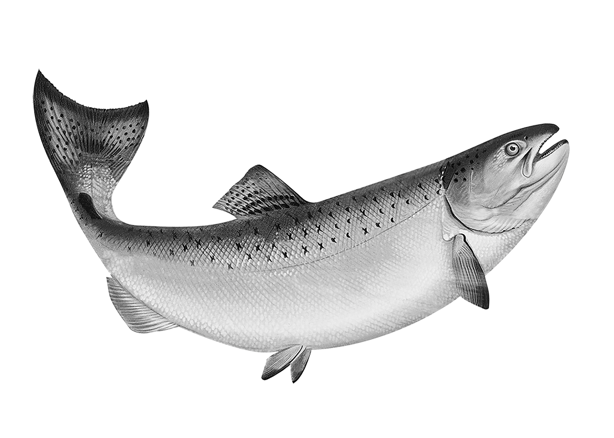
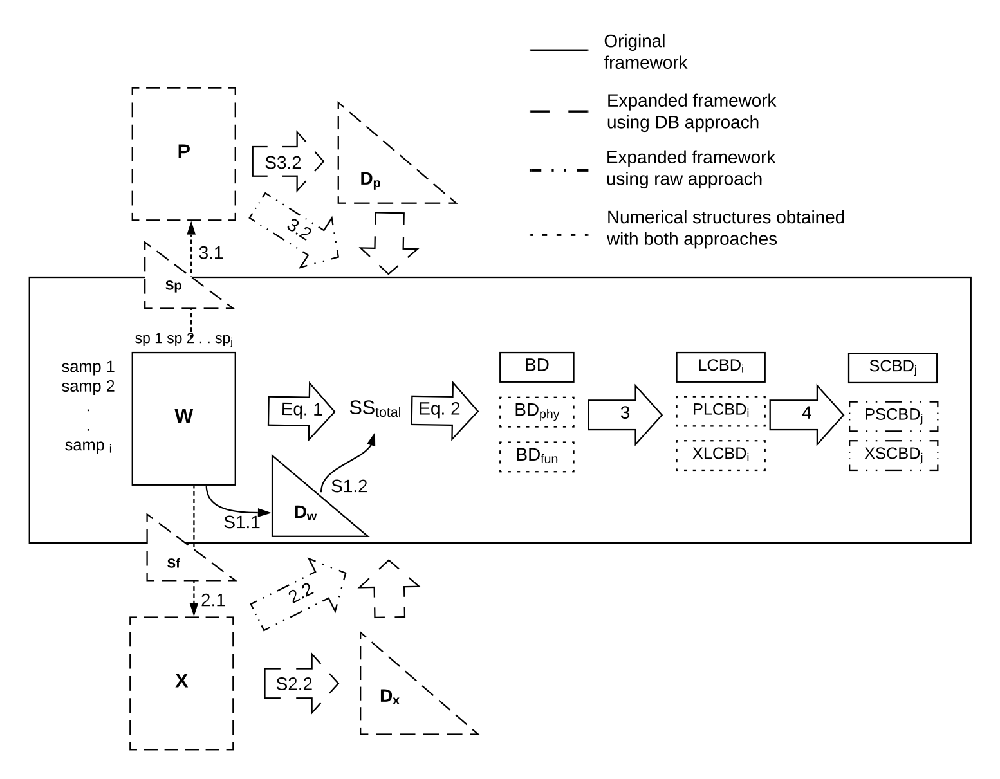
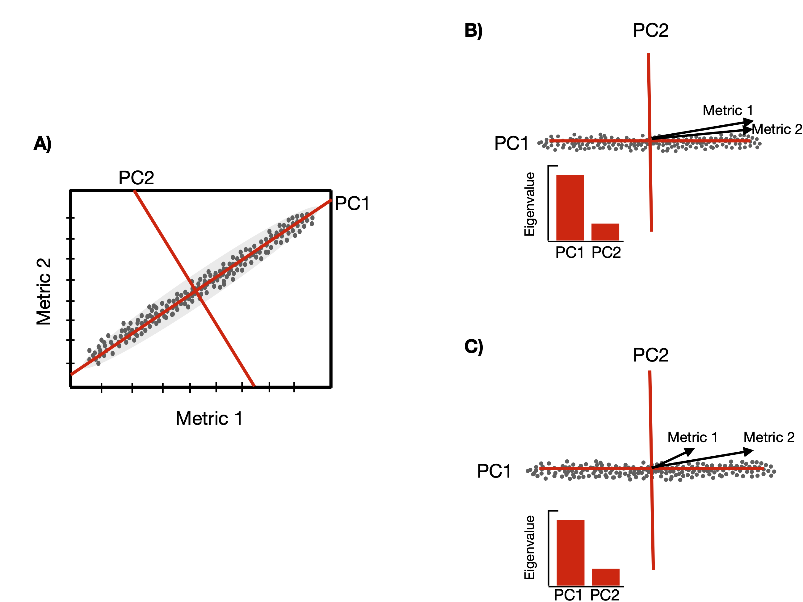
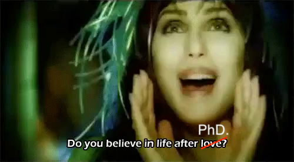
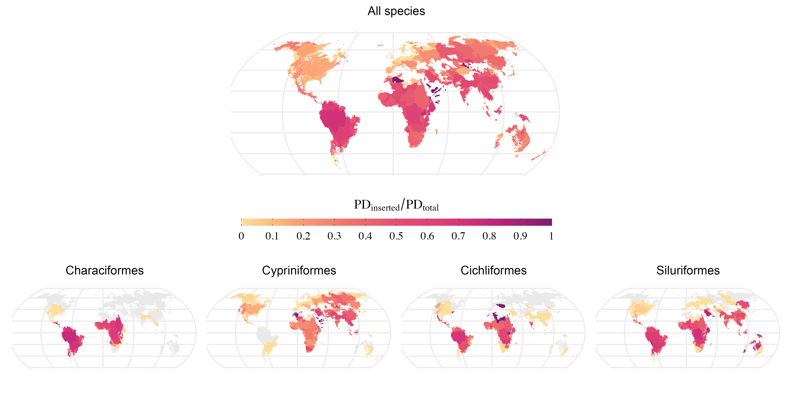

```{r setup, include=FALSE}
options(htmltools.dir.version = FALSE)
knitr::opts_chunk$set(collapse = TRUE,
                      fig.retina = 3)

library(ymlthis)
library(tidyverse)
```

layout: true

---

class: title-slide, center, bottom

# `r rmarkdown::metadata$title`

## `r rmarkdown::metadata$subtitle`

### `r rmarkdown::metadata$author`

---
name: clouds
class: center, middle
background-image: url(images/Clouds.jpg)
background-size: cover

```{r meta, echo=FALSE}
library(metathis)
meta() %>%
  meta_general(
    description = "How to Get Your Teaching Materials Online with R Markdown",
    generator = "xaringan and remark.js"
  ) %>% 
  meta_name("github-repo" = "rstudio-education/sharing-short-notice") %>% 
  meta_social(
    title = "Sharing on Short Notice",
    url = "https://rstd.io/sharing",
    image = "https://repository-images.githubusercontent.com/248553842/408a8d80-7363-11ea-96ae-d04b664002df",
    image_alt = "The first slide features a flying machine",
    og_type = "website",
    twitter_card_type = "summary_large_image"
  )
```

???
Thank you everyone for the presence, today is my official presentation for you all,
I'm excited to know you all, even from the screem computer, but that is the safest way that we 
can do this at this moment.

---
template: clouds
class: top, left

.pull-left[
# .big-text[Olá!]
# .big-text[Hello!]
]

???

Hello and Ola, thats the way that we say hello in my birth contry that is Brazil


--

.pull-right[


  
  [`r icon::fa("github")` @GabrielNakamura](https://github.com/GabrielNakamura)  
  [`r icon::fa("twitter")` @gabrielnakamur4](https://twitter.com/gabrielnakamur4)

]

???

So, I prepared this presentation to you. Hope that with this you can know a litle bit about me, 
who I am, both as a person and a researcher, and what brought me to here, in Corpus.

Despite to use this photo on my presentations you will realize that I'm not much into the field work 
to answer the questions that I try to answer in my research projects, but doesn't mean that I don't like to
be in contact with nature.


---
template: clouds

# Who am I?

???

First, a more personal perspective of Who I am when I'm outside the walls of university...

---
template: clouds
class: middle, center
background-image: url(images/Clouds.jpg)
background-size: cover

```{r whoAmI, echo=FALSE}
 
```


???

I'm a biologist, but as a Biologist this tweet defines much of who I am.
I really love nature and be in close contact, but I'm really dreadful at identifications

---
class: middle, center

<div class="flex" style="margin: 0 1em;">
  <div class="column">
    <h3> Homo sapiens <h3>
    
  </div>
  
???

I consider myself just a regular person 
  
--

   <div class="column"style="margin: 0 1em;">
    <h3> Sports enthusiast </h3>
    
  </div>
  

???

In my free time I like to have physical exercices. I had a scholarship to play volleyball in Brazil during my high school years, and this is the sport that I love to pratice untill now when I have the opportunity

---
class: middle, center

<div class="flex" style="margin: 0 1em;">
  <div class="column">
    <h3> Homo Sapiens </h3>
    
  </div>
  
  <div class="column"style="margin: 0 1em;">
    <h3> Sports enthusiast </h3>
    
  </div>
  

--

<div class="column"style="margin: 0 1em;">
    <h3> Bike </h3>
    
  </div>
  
???

I also love to ride by bike, it's help me to moving arround the city and at the same time have some
exercise, bicycle used to be for me my preferred main of transportation in all places that I lived. 
Hope that I can find one here in Corpus soon
  
--

<div class="column"style="margin: 0 1em;">
    <h3> Music </h3>
    
  </div>

???

I also like music, specially guitar. I just play for fun, it helps me to clean my mind, unfortunatelly 
I think that is not the same for my neibours.

--

<div class="column"style="margin: 0 1em;">
    <h3> Photograph </h3>
    
  </div>


???

I'm also a enthusiast of photograph, whenever I can I grab my camera and go outside to take some photos. I
used to maintain I page with my photos on Flickr. My camera and my guitar were two of the few things that
I brought with me from Brazil
  
--
  <div class="column" style="margin: 0 1em;">
    <h3> cooking </h3>
    
  </div>
</div>

???

At least, I love cooking. Love to prepare and share food with other people, but this not means that I'm 
a chef. Hope that we could share some foods in the near future. 

---
class: center
background-image: url("images/brazil-map.jpeg")
background-size: contain

???

As I said, I'm from Brazil, the biggest country in South America.

---
class: center
background-image: url("images/football.jpg")
background-size: cover


???

If I can list things for which Brazil is known abroad, maybe the first thing is the footbal.
Most of brazilians love this game and our national squad won five times the World Cup.

---
class: center
background-image: url("images/nordeste.jpg")
background-size: cover

???

Brazil is also very known for its nature. Here is one of the beatifull isolated beaches in the northeast 
of Brazil that I had the luck to be a few years ago.

---
class: center
background-image: url("images/canyons.jpg")
background-size: cover

???

Here just one more landscape that we can find in Brazil, this is in the South part of the country.

---
class: center
background-image: url("images/MS-BR.jpeg")
background-size: contain

???

Specifically from this State, called Mato Grosso do Sul. A very tropical state located at the center of
Brazil.

---
class: center
background-image: url("images/natural-beauty-MS.png")
background-size: contain

???

That is also known by its exhuberant nature, particularly its rivers with crystaline waters. This is one 
of them that I had the luck to known.

---
class: center
background-image: url("images/MS.jpg")
background-size: cover

???

And more specifically, this is a sunset view of my hometown, Tres Lagoas, something like Three Lake City.

---

name: clouds2
class: center, middle
background-image: url(images/Clouds.jpg)
background-size: cover

???

So, here I fineshed the nostalgic part of this presentation, and
now a little bit of my academic background

---

name: clouds
class: center, middle
background-image: url(images/Clouds.jpg)
background-size: cover

# Before TAMUCC...

???
What do I did before land here in TAMUCC

---
class: middle, center

<div class="flex" style="margin: 0 1em;">
  <div class="column">
    <h3> Graduation in Biology </h3>
    
  </div>

???

I have a degree in Biological Sciences in the Federal University of Mato Grosso do Sul in Brazil

--
  
  <div class="column"style="margin: 0 1em;">
    <h3> MsC Ecology and conservarion </h3>
    
  </div>
  
???

After that I earned my master degree at the same institution in Brazil, in which I investigated the factors
influencing the assembly of freshwater fish communities. During my master's thesis I started to use be familiar with numerical tools to detect patterns and processess acting in ecological communities, like
different diversity metrics, mathematical models and programming in R. 
I defended my master's thesis by presenting a new method to quantify the dimensionality of diversity in
freshwater fish communities.

--

<div class="column"style="margin: 0 1em;">
    <h3> PhD. Ecology </h3>
    
  </div>

???

Then, in 2015 I started my Phd in Ecology at Federal University of Rio Grande do Sul in the south region
of Brazil. Through 2015 to 2019 my research was guided by trying to answer which do we mean by biological 
diversity? 

---

## PhD. Dimensionality of Biodiversity

.pull-left[
```{r echo=FALSE}
 
```
]

.footnote[
Ecography paper [here](https://onlinelibrary.wiley.com/doi/full/10.1111/ecog.04574)
]


--

.center2[
- Dimensionality concept .green[updated]

- R package [.green[`Dimensionality`]](https://github.com/GabrielNakamura/Dimensionality_package)
]

???

Particularly, during four years I've tried to understand how biodiversity is distributed over space, 
and how the best ways to measure it, so I developed a framework that helped in show which dimensions of biological diversity consist in the most important to capture the information contained in communities.
To do this I relied on the dimensionality concept and developed a updated framework to measure it.
This framework is described in that article and a R package to calculate the metrics are available in this
package.

---

## PhD. Development of New Beta Diversity Indexes

.pull-left[
```{r echo=FALSE}
 
```
]

.footnote[
Ecology paper [here](https://esajournals.onlinelibrary.wiley.com/doi/abs/10.1002/ecy.3122)
]

--

.center2[
- Beta diversity metrics that include .green[Phylogenetic, and
Functional dimensions]

- Also available in R package [.green[`Dimensionality`]](https://github.com/GabrielNakamura/Dimensionality_package)
]


???

Still with the aim to effectively represent biological diversity, I created new metrics to measure 
different components of beta diversity. Basically we extent a proposition from Legendre and De caceres
proposed in 2010 to accommodate different facets of beta diversity, like phylogenetic and functional in 
the same framework. This work is avaiable in this paper in Ecology journal and the metrics can be calculated
using the same package Dimensionality.

---
class: middle, center

<div class="flex" style="margin: 0 1em;">
  <div class="column">
    <h3> Graduation in Biology </h3>
    
  </div>

  <div class="column"style="margin: 0 1em;">
    <h3> MsC Ecology and conservarion </h3>
    
  </div>
  

<div class="column"style="margin: 0 1em;">
    <h3> PhD. Ecology </h3>
    
  </div>
  

<div class="column"style="margin: 0 1em;">
    <h3> Postdoc UFRGS </h3>
    
  </div>


---
template: clouds
class: middle, center
background-image: url(images/Clouds.jpg)
background-size: cover

---
template: clouds2
class: middle, center
background-image: url(images/Clouds.jpg)
background-size: cover

## From patterns to process

--

### How historical factors affect the current distribition of biological diversity?

---
template: clouds2
class: middle, center
background-image: url(images/Clouds.jpg)
background-size: cover

# After PhD



---

## Development of Methods in Biogeography 

.pull-left[
```{r echo=FALSE, out.width="90%"}
 knitr::include_graphics("images/Phy_endemism.png")
```
```{r echo=FALSE, out.width="90%"}
knitr::include_graphics("images/Jetz_age_arrival.png")
```
.footnote[GitHub repo [here](https://github.com/GabrielNakamura/DivB_metrics)]

]

--

.center2[
- Development of .green[Model-based] Phylogenetic metrics

- Unification Macroecology, Macroevolution and Community Ecology
]

???

Since my training were basically based in Community ecology theory and methods, I started to note that 
most of the metrics that we use in this field cannot be used to differentiate between contemporary and 
historical process acting on the assembly of community. Thus, to tackle this issue, I started to adapt the 
common metrics used in community ecology, like PD and PE, to be able to capture historical process. 

This was done by coupling these metrics with methods of ancestral area reconstruction. This allowed to 
decompose those metrics in a portion that represent the diversity generated by historical process like in-situ diversification and historical dispersal.

For those who want to see more about the technical details, you can access github codes for this project


---

## Development of Methods in Biogeography

.pull-left[
```{r echo=FALSE, out.width="50%"}
 knitr::include_graphics("images/Logo_FishPhyloMaker.png")
```
]

---

## Development of Methods in Biogeography

.pull-left[
.center[
```{r echo=FALSE, out.width="30%"}
 knitr::include_graphics("images/Logo_FishPhyloMaker.png")
```
]

```{r echo=FALSE, out.width="100%"}
 
```

]

.footnote[
Ecological informatics [paper here](https://www.sciencedirect.com/science/article/abs/pii/S1574954121002727)
]

--

.center2[
- Fast and reliable way to produce phylogenies

- Computation of .green[Darwinian Shortfalls]
]

---
template: clouds2
class: middle, center
background-image: url(images/Clouds.jpg)
background-size: cover

# Now in TAMUCC...


---

## Development of biogeographical methods

- Still working on the development of biogeographical inferences tools in the context of Bioregion 
framework. 

- Support graduate and undergrad students in their tasks

- Develop visual tools for biogeographical inference through shiny applications
