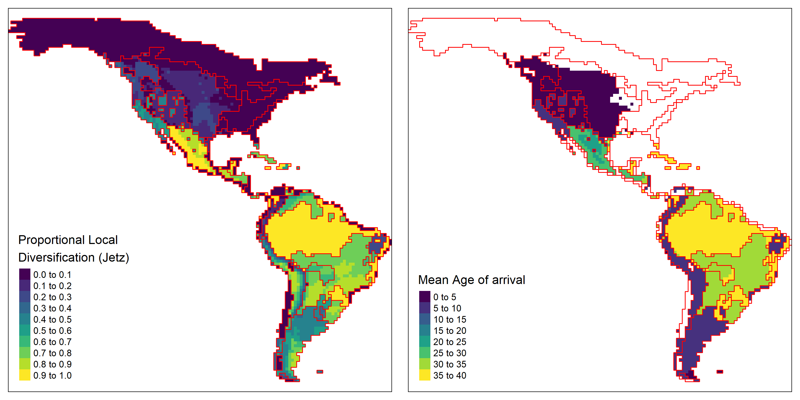

```{r setup, include=FALSE}
options(htmltools.dir.version = FALSE)
knitr::opts_chunk$set(collapse = TRUE,
                      fig.retina = 3)

library(ymlthis)
library(tidyverse)
```

layout: true

---

class: title-slide, center, bottom

# `r rmarkdown::metadata$title`

## `r rmarkdown::metadata$subtitle`

### `r rmarkdown::metadata$author`

---
name: clouds
class: center, middle
background-image: url(images/Clouds.jpg)
background-size: cover

```{r meta, echo=FALSE}
library(metathis)
meta() %>%
  meta_general(
    description = "How to Get Your Teaching Materials Online with R Markdown",
    generator = "xaringan and remark.js"
  ) %>% 
  meta_name("github-repo" = "rstudio-education/sharing-short-notice") %>% 
  meta_social(
    title = "Sharing on Short Notice",
    url = "https://rstd.io/sharing",
    image = "https://repository-images.githubusercontent.com/248553842/408a8d80-7363-11ea-96ae-d04b664002df",
    image_alt = "The first slide features a flying machine",
    og_type = "website",
    twitter_card_type = "summary_large_image"
  )
```

???
Thank you everyone for the presence, today is my official presentation for you all, some of you I already know, from the digital world and the scream computer, and now finally we have the opportunity to a in person meeting. Today I will give you a brief presentation of who I am, my research interesets and what I'm gonna do here at Texas A&M for the next three years.

---
template: clouds
class: top, left

.pull-left[
# .big-text[Olá!]
# .big-text[Hello!]
]

???

Hello and Ola, thats the way that we say hello in my birth country that is Brazil


--

.pull-right[


  
  [`r icon::fa("github")` @GabrielNakamura](https://github.com/GabrielNakamura)  
  
  [`r icon::fa("door-open")` Personal website](https://gabrielnakamura.netlify.app/)
  
  [`r icon::fa("twitter")` @gabrielnakamur4](https://twitter.com/gabrielnakamur4)
  

]

???

For those who become interested in my work you can find a little bit more in my website and github account, and of course catch me up here at A&M


---
template: clouds

# Who am I?

???

First, a little bit about who I'm outside the walls of university...

---
class: middle, center

<div class="flex" style="margin: 0 1em;">
  <div class="column">
    <h3> Homo sapiens <h3>
    
  </div>
  
???

Generally speaking I'm just a regular person with some interests like
  
--

   <div class="column"style="margin: 0 1em;">
    <h3> Sports enthusiast </h3>
    
  </div>
  

???

In my free time I like to have physical exercises. I had a scholarship to play volleyball in Brazil during my high school years, and this is the sport that I like to play when I have the opportunity

---
class: middle, center

<div class="flex" style="margin: 0 1em;">
  <div class="column">
    <h3> Homo Sapiens </h3>
    
  </div>
  
  <div class="column"style="margin: 0 1em;">
    <h3> Sports enthusiast </h3>
    
  </div>
  

--

<div class="column"style="margin: 0 1em;">
    <h3> Bike </h3>
    
  </div>
  
???

I also enjoy to ride my bike, it's help me to moving around the city and at the same time have some
exercise. 
Hope that I can find one here in Corpus soon
  
--

<div class="column"style="margin: 0 1em;">
    <h3> Music </h3>
    
  </div>

???

I also like music, specially guitar. Like to play doesn't mean that I know to play, so, I just play for fun, it helps me to clean my mind. Hope that my neighbors understand it.

--

<div class="column"style="margin: 0 1em;">
    <h3> Photograph </h3>
    
  </div>


???

I'm also a enthusiast of photographs, whenever I can I grab my camera and go outside to take some photos. I
used to maintain I page with my photos on Flickr.
  
--
  <div class="column" style="margin: 0 1em;">
    <h3> cooking </h3>
    
  </div>
</div>

???

At least, I love cooking. Love to prepare and share food with other people, but this not means that I'm 
a chef. Hope that we could share some foods in the near future. 

---
class: center
background-image: url("images/brazil-map.jpeg")
background-size: contain

???

As I said, I'm from Brazil

---
class: center
background-image: url("images/football.jpg")
background-size: cover


???

If I can list things for which Brazil is known abroad, maybe the first thing is the football.
Most of brazilian people love this game and our national squad had won five times the World Cup.

---
class: center
background-image: url("images/nordeste.jpg")
background-size: cover

???

Brazil is also very known for its nature. Here is one of the beatifull isolated beaches in the northeast 
of Brazil that I had the luck to be a few years ago.

---
class: center
background-image: url("images/canyons.jpg")
background-size: cover

???

Here just one more landscape that we can find in Brazil, this is in the South part of the country.

---
class: center
background-image: url("images/MS-BR.jpeg")
background-size: contain

???

Specifically from this State, called Mato Grosso do Sul. A very tropical state located at the center of
Brazil.

---
class: center
background-image: url("images/natural-beauty-MS.png")
background-size: contain

???

That is also known by its exuberant nature, particularly its rivers with crystalline waters. This is one 
of them that I had the luck to known.


---

name: clouds2
class: center, middle
background-image: url(images/Clouds.jpg)
background-size: cover

???

So, here I finished the nostalgic part of this presentation, and
now a little bit of my academic background

---

name: clouds
class: center, middle
background-image: url(images/Clouds.jpg)
background-size: cover

## What influence the distribution of biological diversity on earth?

--

### Reliable description of biodiversity patterns accross space and time

--

### Search for the factors that generate these patterns

---

## Tools to describe different components of biodiversity (Ph.D)

.pull-left[
```{r echo=FALSE}
 knitr::include_graphics("images/dimensionality.png")
```
]

.footnote[
Ecography paper [here](https://onlinelibrary.wiley.com/doi/full/10.1111/ecog.04574)
]

???
So, during my Ph.D I developed numerical tools to describe different components of biological diversity, with special focus on the development of numerical methods that allowed to describe alpha and beta diversity patterns.

--

.center2[
- Dimensionality concept 

- R package [.green[`Dimensionality`]](https://github.com/GabrielNakamura/Dimensionality_package)
]

???

Particularly, I developed a tool that allows to identify how to measure biological diversity when the focus is to maximize the amount o information present in ecological assemblages.
To do this I relied on the dimensionality concept and developed a updated framework to measure it.
This framework is described in that article and a R package to calculate the metrics are available in this
package.

---

## Tools to describe different components of biodiversity (Ph.D)

.pull-left[
```{r echo=FALSE}
 knitr::include_graphics("images/phd.png")
```
]

.footnote[
Ecology paper [here](https://esajournals.onlinelibrary.wiley.com/doi/abs/10.1002/ecy.3122)
]

--

.center2[
- Beta diversity metrics that include .green[Phylogenetic, and
Functional dimensions]

- Also available in R package [.green[`Dimensionality`]](https://github.com/GabrielNakamura/Dimensionality_package)
]


???

Still with the aim to effectively represent biological diversity, I also developed a comprehensive framework to capture different components of beta diversity. Basically we extent a proposition from Legendre and De Caceres
proposed in 2010 to accommodate different facets of beta diversity, like phylogenetic and functional in 
the same framework. This work is available in this paper in Ecology journal and the metrics can be calculated using the same package Dimensionality that I mentioned early.

---
template: clouds2
class: middle, center
background-image: url(images/Clouds.jpg)
background-size: cover

## What influence the distribution of biological diversity on earth?

???
As I said, capture effectively biodiversity patterns is just one 
step towards the understanding of the causes of biodiversity distribution on earth

--

### From patterns to process: searching for the causes

???
To fully answer this question we need to explain biodiversity patterns by searching for what generates it

--

#### How historical factors affect the current distribition of biological diversity?

???
And in the last year this is what I'm trying to do, specifically I'm interested in understand how processes associated with speciation and historical dispersal are responsible to generate the current patterns of
distribution in biological diversity

---

## Development of Methods in Historical Biogeography - Ongoing

.pull-left[
```{r echo=FALSE, out.width="90%"}
 knitr::include_graphics("images/Phy_endemism.png")
```
```{r echo=FALSE, out.width="90%"}

```
.footnote[GitHub repo [here](https://github.com/GabrielNakamura/DivB_metrics)]

]

???
Now I'm developing methods in historical biogeography that disentangle the importance of in situ speciation
and historical dispersal to generate spatial patterns in Phylogenetic diversity of assemblages

--

.center2[
- Development of .green[Model-based] Phylogenetic metrics

- Unification Macroecology, Macroevolution and Community Ecology
]

???

Briefly I started to adapt common metrics used in community ecology, like PD and PE, and merge this metrics with macroevolutionary models, like ancestral area reconstruction, to be able to capture historical process.

For those who want to see more about the technical details, you can access github codes for this project and the package that Im calling, just for now, as Rrodotus.

---
template: clouds2
class: middle, center
background-image: url(images/Clouds.jpg)
background-size: cover

## Biologically induced Side-effects 

???
Like in a trip, the final destination is the objective, but in the middle of it you realize that there is a lot of other nice things that happen in the route

---
class: middle, center

## R packages

<div class="flex" style="margin: 0 1em;">
  <div class="column">
    <h3> FishPhyloMaker </h3>
    
  </div>
  
???
In my personal trip to find the answer for what influence biodiversity patterns in space and time I found myself developing some R packages, particularly related to manipulation of phylogenetic information, like 
FishPhyloMaker, that allows to obtain phylogenetic trees for fish species, check scientific names and calculate Darwinian shortfalls.

--

<div class="column"style="margin: 0 1em;">
    <h3> naturaList </h3>
    
  </div>
  
???
naturaList, with a series of spatial tools and for occurrence records and check procedures for taxonomic identification

--

<div class="column"style="margin: 0 1em;">
    <h3> mcfly </h3>
    
  </div>


???
And mcfly, to model the effects of selection in species diversity in metacommunities

---
template: clouds2
class: middle, center
background-image: url(images/Clouds.jpg)
background-size: cover

# Now in TAMUCC...

---

class: middle, center

## Development of biogeographical methods

<div class="flex" style="margin: 0 1em;">
  <div class="column">
    <h3> Phyloregion </h3>
    
  </div>
  
???
So, now my aim here is to improve the tools presented n phyloregion package

--

<div class="column"style="margin: 0 1em;">
    <h3> teaching </h3>
    
  </div>
  
???
but also, as far as I can, I want to help undergrad and graduate students, I like to share and help whenever I can, I believe that 
we always have things to learn from other in the teaching proccess 

