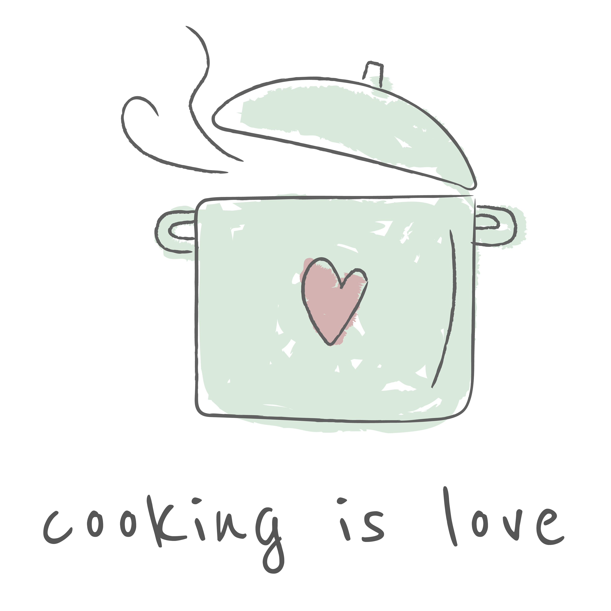
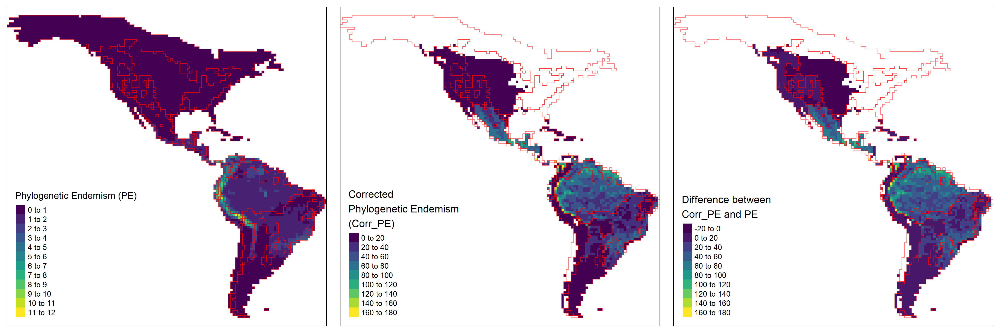

```{r setup, include=FALSE}
options(htmltools.dir.version = FALSE)
knitr::opts_chunk$set(collapse = TRUE,
                      fig.retina = 3)

library(ymlthis)
library(tidyverse)
```

layout: true

---

class: title-slide, center, bottom

# `r rmarkdown::metadata$title`

## `r rmarkdown::metadata$subtitle`

### `r rmarkdown::metadata$author`

---
name: clouds
class: center, middle
background-image: url(images/Clouds.jpg)
background-size: cover

```{r meta, echo=FALSE}
library(metathis)
meta() %>%
  meta_general(
    description = "How to Get Your Teaching Materials Online with R Markdown",
    generator = "xaringan and remark.js"
  ) %>% 
  meta_name("github-repo" = "rstudio-education/sharing-short-notice") %>% 
  meta_social(
    title = "Sharing on Short Notice",
    url = "https://rstd.io/sharing",
    image = "https://repository-images.githubusercontent.com/248553842/408a8d80-7363-11ea-96ae-d04b664002df",
    image_alt = "The first slide features a flying machine",
    og_type = "website",
    twitter_card_type = "summary_large_image"
  )
```

---
template: clouds
class: top, left

.pull-left[
# .big-text[Olá!]
# .big-text[Hello!]
]

--

.pull-right[


  
  [`r icon::fa("github")` @GabrielNakamura](https://github.com/GabrielNakamura)  
  [`r icon::fa("twitter")` @gabrielnakamur4](https://twitter.com/gabrielnakamur4)

]

???

Hello everyone, I prepared this little presentation to present myself, who I am 
and what brought me to here, in Corpus.

This is me with a butterfly in my hand
She was released and goes well, I hope


---
template: clouds

# Who am I?

???

Who am I?

---
template: clouds
class: middle, center
background-image: url(images/Clouds.jpg)
background-size: cover

```{r whoAmI, echo=FALSE}
 
```


???
In a nutshell...
Despite looks like a biologist in a field work 
I am not much into the organisms, and my taxonomic 
knowledge is better represented by this Tweet

---
class: middle, center

<div class="flex" style="margin: 0 1em;">
  <div class="column">
    <h3> Homo sapiens <h3>
    
  </div>
  
???

Just a regular person 
  
--

   <div class="column"style="margin: 0 1em;">
    <h3> Sports enthusiast </h3>
    
  </div>
  

???

That more recently moved all the way from BR to US

---
class: middle, center

<div class="flex" style="margin: 0 1em;">
  <div class="column">
    <h3> Homo Sapiens </h3>
    
  </div>
  
  <div class="column"style="margin: 0 1em;">
    <h3> Sports enthusiast </h3>
    
  </div>
  

--

<div class="column"style="margin: 0 1em;">
    <h3> Bike </h3>
    
  </div>
  
--

<div class="column"style="margin: 0 1em;">
    <h3> Music </h3>
    
  </div>

--

<div class="column"style="margin: 0 1em;">
    <h3> Photograph </h3>
    
  </div>


???

But they're stuck on your computer, and you need to share them easily others with out filling up their inboxes.
  
--
  <div class="column" style="margin: 0 1em;">
    <h3> cooking </h3>
    
  </div>
</div>

???

And--- you probably have a new classroom space that looks like this-- so sharing needs to be done 100% online

---
class: center
background-image: url("images/brazil-map.jpeg")
background-size: contain

???

Right now I´m felling exactly like this, 

Everything seems to need my attention,

but I cannot do everything.

---
class: center
background-image: url("images/football.jpg")
background-size: cover


???

Specifically from this State, called Mato Grosso do Sul

---
class: center
background-image: url("images/nordeste.jpg")
background-size: cover

---
class: center
background-image: url("images/canyons.jpg")
background-size: cover

---
class: center
background-image: url("images/MS-BR.jpeg")
background-size: contain

???

Specifically from this State, called Mato Grosso do Sul

---
class: center
background-image: url("images/natural-beauty-MS.png")
background-size: contain

???

Specifically from this State, called Mato Grosso do Sul

---
class: center
background-image: url("images/MS.jpg")
background-size: cover

???

Specifically from this State, called Mato Grosso do Sul

---
name: clouds
class: center, middle
background-image: url(images/Clouds.jpg)
background-size: cover

# Before TAMUCC...

---
class: middle, center

<div class="flex" style="margin: 0 1em;">
  <div class="column">
    <h3> Graduation in Biology </h3>
    
  </div>
  
--
  
  <div class="column"style="margin: 0 1em;">
    <h3> MsC Ecology and conservarion </h3>
    
  </div>
  

--

<div class="column"style="margin: 0 1em;">
    <h3> PhD. Ecology </h3>
    
  </div>
  
--

<div class="column"style="margin: 0 1em;">
    <h3> Postdoc UFRGS </h3>
    
  </div>


???

And--- you probably have a new classroom space that looks like this-- so sharing needs to be done 100% online

---

## PhD. Dimensionality of Biodiversity

.pull-left[
```{r echo=FALSE}
 
```
]

.footnote[
Ecography paper [here](https://onlinelibrary.wiley.com/doi/full/10.1111/ecog.04574)
]


--

.center2[
- Dimensionality concept .green[updated]

- R package [.green[`Dimensionality`]](https://github.com/GabrielNakamura/Dimensionality_package)
]

---

## PhD. Development of New Beta Diversity Indexes

.pull-left[
```{r echo=FALSE}
 
```
]

.footnote[
Ecology paper [here](https://esajournals.onlinelibrary.wiley.com/doi/abs/10.1002/ecy.3122)
]

--

.center2[
- Beta diversity metrics that include .green[Phylogenetic, and
Functional dimensions]

- Also available in R package [.green[`Dimensionality`]](https://github.com/GabrielNakamura/Dimensionality_package)
]


???

Proposition of new beta diversity metrics

---
template: clouds2
class: middle, center
background-image: url(images/Clouds.jpg)
background-size: cover

# After PhD


---

## Development of Methods in Biogeography 

.pull-left[
```{r echo=FALSE, out.width="90%"}
 
```
```{r echo=FALSE, out.width="90%"}
knitr::include_graphics("images/Jetz_age_arrival.png")
```
.footnote[GitHub repo [here](https://github.com/GabrielNakamura/DivB_metrics)]

]

--

.center2[
- Development of .green[Model-based] Phylogenetic metrics

- Unification Macroecology, Macroevolution and Community Ecology
]

---

## Development of Methods in Biogeography

.pull-left[
```{r echo=FALSE, out.width="50%"}
 knitr::include_graphics("images/Logo_FishPhyloMaker.png")
```
]

---

## Development of Methods in Biogeography

.pull-left[
.center[
```{r echo=FALSE, out.width="30%"}
 knitr::include_graphics("images/Logo_FishPhyloMaker.png")
```
]

```{r echo=FALSE, out.width="100%"}
 
```

]

.footnote[
Ecological informatics [paper here](https://www.sciencedirect.com/science/article/abs/pii/S1574954121002727)
]

--

.center2[
- Fast and reliable way to produce phylogenies

- Computation of .green[Darwinian Shortfalls]
]

---
template: clouds2
class: middle, center
background-image: url(images/Clouds.jpg)
background-size: cover

# Now in TAMUCC...


---

## Development of biogeographical methods


